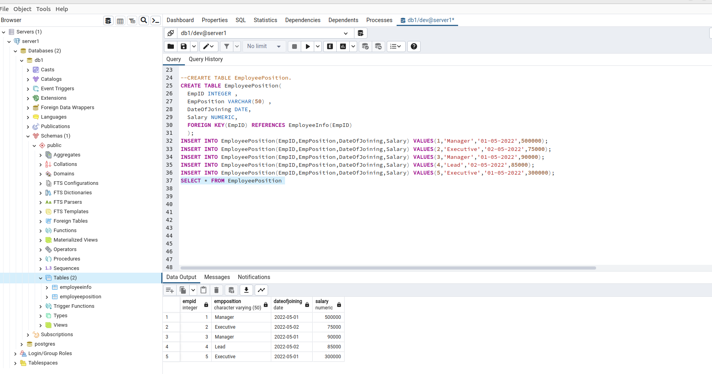

# PostgreSQL-DB-Assessment

## Table Creation 

(i) <b>EmployeeInfo Table :</b>

>CREATE TABLE EmployeeInfo(  
>EmpID SERIAL NOT NULL,    
>EmpFname VARCHAR(100),  
>EmpLname VARCHAR(100) ,  
>Department VARCHAR(100),  
>Project VARCHAR(50),    
>Address VARCHAR(200),    
>DOB DATE,            
>Gender CHAR    
> );
>
>
> INSERT into EmployeeInfo (EmpFname,EmpLname,Department,Project,Address,DOB,Gender) VALUES ('Sanjay','Mehra','HR','P1','Hyderabad(HYD)','1-12-1976' , 'M');  
>INSERT into EmployeeInfo (EmpFname,EmpLname,Department,Project,Address,DOB,Gender) VALUES ('Ananya','Mishra','Admin','P2','Delhi(DEL)','02-05-1968', 'F');   
>insert into EmployeeInfo (EmpFname,EmpLname,Department,Project,Address,DOB,Gender) VALUES ('Rohan','Diwan','Account','P3','Mumbai(BOM)','01-01-1980', >'M');   
>insert into EmployeeInfo (EmpFname,EmpLname,Department,Project,Address,DOB,Gender) VALUES ('Sonia','Kulkarni','HR','P1','Hyderabad(HYD)','02-05-1992', > 'F');   
>insert into EmployeeInfo (EmpFname,EmpLname,Department,Project,Address,DOB,Gender) VALUES ('Ankit','Kapoor','Admin','P2','Delhi(DEL)','03-07-1994', 'M');

<b>Query Output :</b>

(ii) <b>EmployeePosition Table </b>

>CREATE TABLE EmployeePosition(    
>  EmpID INTEGER ,                  
>  EmpPosition VARCHAR(50) ,     
>  DateOfJoining DATE,     
>  Salary NUMERIC,    
>  FOREIGN KEY(EmpID) REFERENCES EmployeeInfo(EmpID)   
>  );     
>INSERT INTO EmployeePosition(EmpID,EmpPosition,DateOfJoining,Salary) VALUES(1,'Manager','01-05-2022',500000);    
>INSERT INTO EmployeePosition(EmpID,EmpPosition,DateOfJoining,Salary) VALUES(2,'Executive','02-05-2022',75000);    
>INSERT INTO EmployeePosition(EmpID,EmpPosition,DateOfJoining,Salary) VALUES(3,'Manager','01-05-2022',90000);    
>INSERT INTO EmployeePosition(EmpID,EmpPosition,DateOfJoining,Salary) VALUES(4,'Lead','02-05-2022',85000);   
>INSERT INTO EmployeePosition(EmpID,EmpPosition,DateOfJoining,Salary) VALUES(5,'Executive','01-05-2022',300000);   
>SELECT * FROM EmployeePosition 

<b> Query Output : </b>

## Queries:
(1) Write a query to fetch the number of employees working in the department ‘Admin’.  
> SELECT COUNT(*) query_one_output FROM EmployeeInfo WHERE Department='Admin';

 

 Here COUNT(*) will fetch all the rows Where Department name is "Admin" and field is renames as "query_one_output".

